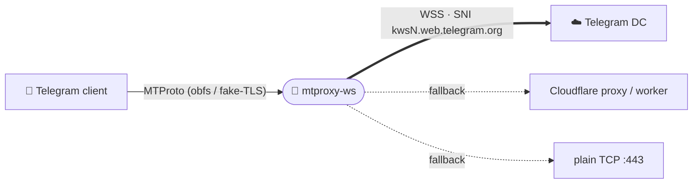

<div align="center">


# mtproxy-ws

**A self-contained Telegram MTProto ↔ WebSocket bridge proxy engine.**

[](LICENSE)


[Русский](README.md) · **English**

</div>

---

> 🧬 An independent from-scratch C implementation. The MTProto-over-WebSocket idea
> and the default Cloudflare/DC parameters come from the MIT project
> [Flowseal/tg-ws-proxy](https://github.com/Flowseal/tg-ws-proxy) (credits below).

`mtproxy-ws` accepts ordinary MTProto-proxy connections from a Telegram client and
relays them to the Telegram data centres over a **raw WSS** connection (TLS to the
DC IP with the `kwsN.web.telegram.org` SNI) — so the traffic looks like an ordinary
HTTPS WebSocket. When a DC has no WS route it falls back to a Cloudflare-proxied
domain, a Cloudflare Worker, or a plain TCP connection.

It ships as a **shared library** (`libmtproxyws`), a **headless CLI**
(`mtproxy-ws`), a **pkg-config** file and a **Vala binding** — written in plain C
(GLib + OpenSSL), with **no GTK / GUI dependencies**. A separate GTK4 front-end can
drive the very same library.



## ✨ Features

- **MTProto obfuscated handshake** — abridged `ef` / intermediate `ee` / secure
  `dd`, with a per-session re-encryption bridge.
- **Raw WebSocket client** to the Telegram DCs (TLS-to-IP, SNI = web domain,
  client-masked frames) — no cert verification, like the official web client.
- **Fallback chain** — Cloudflare-proxy → Cloudflare Worker → plain TCP to the DC.
- **Fake-TLS** (`ee` secret) — verifies the client's fake ClientHello (HMAC-SHA256),
  replies with a ServerHello, then frames the obfuscated stream inside TLS
  application-data records. Non-matching clients are passed through to a real
  masking domain or redirected.
- **WS connection pool** — pre-warmed, refilled-in-background WSS connections per
  `(dc, media)` so new clients skip the TLS+WS handshake.
- Thread-per-connection with `poll()`; live stats (connections, bytes up/down).

## 📦 Build & install

> Dependencies: `glib-2.0`, `gio-2.0`, OpenSSL (`libssl`, `libcrypto`), `meson`,
> `ninja`, a C compiler.

```sh
meson setup build
ninja -C build
sudo ninja -C build install
```

| Option | Default | Effect |
|---|:---:|---|
| `-Dservice=true` | `false` | Install the systemd unit `mtproxy-ws.service`. |

Installs `libmtproxyws.so`, the `mtproxy-ws` CLI, `proxy.h` / `crypto.h` (under
`mtproxy-ws/`), `mtproxy-ws.pc`, and the Vala binding (`mtproxy-ws.vapi` + `.deps`).

## 🚀 CLI usage

```sh
mtproxy-ws --secret $(head -c16 /dev/urandom | xxd -p) --port 1443
```

| Flag | Description |
|---|---|
| `-H, --host` | Listen host (default `127.0.0.1`; `0.0.0.0` for a server). |
| `-p, --port` | Listen port (default `1443`). |
| `-s, --secret` | MTProto secret, 32 hex chars (random if omitted). |
| `--dc-ip DC:IP` | WS redirect for a DC, repeatable (default `2`,`4` → `149.154.167.220`). |
| `--pool-size N` | Pre-warmed WS per DC (default `4`, `0` disables). |
| `--no-cfproxy` | Disable the Cloudflare-proxy fallback. |
| `--cf-domain D` | User Cloudflare base domain, repeatable. |
| `--worker-domain D` | Cloudflare Worker domain, repeatable. |
| `--fake-tls-domain D` | Enable Fake-TLS (`ee` secret) masking with this SNI. |

It prints the `tg://proxy?…` link and runs until `SIGINT` / `SIGTERM`.

### As a system service

```sh
meson setup build -Dservice=true && sudo ninja -C build install
sudoedit /etc/mtproxy-ws.conf      # MTPROXY_WS_ARGS="--port 1443 --secret <hex>"
sudo systemctl enable --now mtproxy-ws
```

## 🧩 Use as a library

**C** — via pkg-config (`mtproxy-ws`):

```c
#include <mtproxy-ws/proxy.h>

unsigned char secret[16] = { /* 16 bytes */ };
TgwsProxy *p = tgws_proxy_new ("127.0.0.1", 1443, secret);
tgws_proxy_add_dc (p, 2, "149.154.167.220");
tgws_proxy_set_pool_size (p, 4);
tgws_proxy_start (p);              /* spawns the listener thread */
/* … run a GLib main loop … */
tgws_proxy_stop (p);
tgws_proxy_free (p);
```

```sh
cc demo.c $(pkg-config --cflags --libs mtproxy-ws) -o demo
```

**Vala** — via the bundled binding:

```vala
var p = new TgWsProxy.Engine ("127.0.0.1", 1443, secret /* uint8[16] */);
p.add_dc (2, "149.154.167.220");
p.set_pool_size (4);
p.start ();
```

```sh
valac --pkg mtproxy-ws --pkg gio-2.0 demo.vala
```

## ⚠️ Known issue: photos/videos not loading

If photos or videos fail to load through the proxy, in the DC→IP list (`--dc-ip`,
config `dc_ip`) keep only `4:149.154.167.220` and remove the rest. If that doesn't
help, clear the list entirely (all DCs then go through the CF-proxy/worker/TCP
fallback). This most often affects accounts **without Telegram Premium**. As an
alternative, set your own Cloudflare domain (`--cf-domain`).

## 🔒 Security

- **Message security comes from MTProto itself** (end-to-end between the client
  and the data centre: an `auth_key` established via DH and authenticated by the
  DC's RSA keys pinned in the Telegram client). The proxy and its TLS are only an
  obfuscation wrapper, so even a full MITM on the proxy↔CF↔DC path **cannot read
  or forge messages** and cannot impersonate a DC — only metadata and connection
  availability are exposed.
- **The CF domains' TLS certificate is verified by default** (system CA store,
  detected at runtime independent of the distro). The direct DC-IP path is
  intentionally not verified — its certificate can't match the IP, and MTProto
  provides the security there. CF verification can be turned off (`--no-verify-cf`)
  — **only if you understand the risks**.

> ⚠️ **About the default Cloudflare domains.** The built-in CF domain list is
> inherited from the original project and is **not controlled or audited by Another
> TGProxy**. Your connection metadata (not its content) transits through them. The
> project takes **no responsibility** for the availability, behaviour or good faith
> of these third-party domains and the infrastructure behind them. For full control
> use your own domains/workers (`--cf-domain` / `--worker-domain`) or disable the
> fallback (`--no-cfproxy`).

## 🙏 Acknowledgements

The MTProto-over-WebSocket idea and the default Cloudflare/DC parameters come from
the original (MIT-licensed) Python project
**[Flowseal/tg-ws-proxy](https://github.com/Flowseal/tg-ws-proxy)**. Thanks to its
author and everyone who contributed!

**Contributors to the original development:**

[](https://github.com/Flowseal/tg-ws-proxy/graphs/contributors)

## 📄 License

[GPL-3.0-or-later](LICENSE).

<div align="center"><sub>Part of <b><a href="https://github.com/Another-TGProxy">Another TGProxy</a></b></sub></div>
