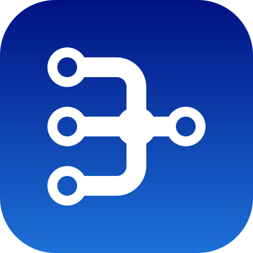
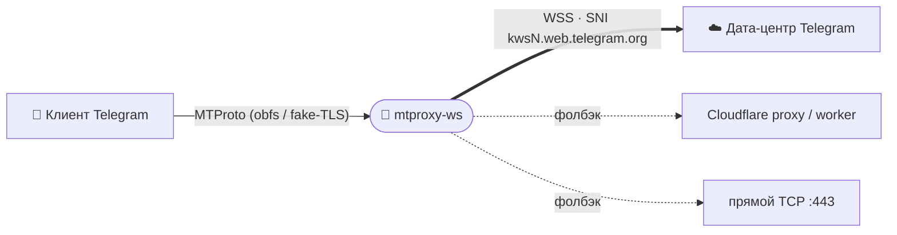

<div align="center">



# mtproxy-ws

**Самодостаточный движок прокси-моста Telegram MTProto ↔ WebSocket.**

[](LICENSE)


**Русский** · [English](README.en.md)

</div>

---

> 🧬 Независимая реализация на C. Идея MTProto-поверх-WebSocket и дефолтные
> параметры Cloudflare/DC — из MIT-проекта
> [Flowseal/tg-ws-proxy](https://github.com/Flowseal/tg-ws-proxy) (благодарности — ниже).

`mtproxy-ws` принимает обычные MTProto-proxy подключения от клиента Telegram и
релеит их к дата-центрам Telegram по **сырому WSS** (TLS на IP дата-центра с SNI
`kwsN.web.telegram.org`) — так трафик выглядит как обычный HTTPS WebSocket. Если у
дата-центра нет WS-маршрута, происходит фолбэк на домен за Cloudflare, Cloudflare
Worker или прямое TCP-соединение.

Поставляется как **разделяемая библиотека** (`libmtproxyws`), **headless CLI**
(`mtproxy-ws`), файл **pkg-config** и **Vala-биндинг** — на чистом C
(GLib + OpenSSL), **без зависимостей от GTK / GUI**. Отдельный GTK4-интерфейс может
использовать ту же библиотеку.



## ✨ Возможности

- **Обфусцированный MTProto-handshake** — abridged `ef` / intermediate `ee` /
  secure `dd`, с посессионным мостом пере-шифрования.
- **Сырой WebSocket-клиент** к дата-центрам Telegram (TLS на IP, SNI = веб-домен,
  client-masked фреймы) — без проверки сертификата, как у официального веб-клиента.
- **Цепочка фолбэка** — Cloudflare-proxy → Cloudflare Worker → прямой TCP к DC.
- **Fake-TLS** (`ee`-секрет) — проверяет поддельный ClientHello клиента
  (HMAC-SHA256), отвечает ServerHello, затем упаковывает обфусцированный поток в
  TLS application-data записи. Несовпавшие клиенты проксируются на реальный
  маскирующий домен или редиректятся.
- **Пул WS-соединений** — преднабранные и дофоняемые в фоне WSS-соединения на
  `(dc, media)`, чтобы новые клиенты пропускали TLS+WS-рукопожатие.
- Поток на соединение с `poll()`; живая статистика (соединения, байты ↑/↓).

## 📦 Сборка и установка

> Зависимости: `glib-2.0`, `gio-2.0`, OpenSSL (`libssl`, `libcrypto`), `meson`,
> `ninja`, компилятор C.

```sh
meson setup build
ninja -C build
sudo ninja -C build install
```

| Опция | По умолчанию | Эффект |
|---|:---:|---|
| `-Dservice=true` | `false` | Установить systemd-юнит `mtproxy-ws.service`. |

Устанавливает `libmtproxyws.so`, CLI `mtproxy-ws`, `proxy.h` / `crypto.h` (в
`mtproxy-ws/`), `mtproxy-ws.pc` и Vala-биндинг (`mtproxy-ws.vapi` + `.deps`).

## 🚀 Использование CLI

```sh
mtproxy-ws --secret $(head -c16 /dev/urandom | xxd -p) --port 1443
```

| Флаг | Описание |
|---|---|
| `-H, --host` | Хост прослушивания (по умолчанию `127.0.0.1`; `0.0.0.0` для сервера). |
| `-p, --port` | Порт (по умолчанию `1443`). |
| `-s, --secret` | MTProto-секрет, 32 hex-символа (случайный, если не задан). |
| `--dc-ip DC:IP` | WS-редирект для DC, повторяемый (по умолчанию `2`,`4` → `149.154.167.220`). |
| `--pool-size N` | Преднабор WS на DC (по умолчанию `4`, `0` — отключить). |
| `--no-cfproxy` | Отключить фолбэк через Cloudflare-proxy. |
| `--cf-domain D` | Свой Cloudflare-домен, повторяемый. |
| `--worker-domain D` | Домен Cloudflare Worker, повторяемый. |
| `--fake-tls-domain D` | Включить Fake-TLS (`ee`-секрет) с этим SNI. |

Печатает ссылку `tg://proxy?…` и работает до `SIGINT` / `SIGTERM`.

### Как системная служба

```sh
meson setup build -Dservice=true && sudo ninja -C build install
sudoedit /etc/mtproxy-ws.conf      # MTPROXY_WS_ARGS="--port 1443 --secret <hex>"
sudo systemctl enable --now mtproxy-ws
```

## 🧩 Как библиотека

**C** — через pkg-config (`mtproxy-ws`):

```c
#include <mtproxy-ws/proxy.h>

unsigned char secret[16] = { /* 16 байт */ };
TgwsProxy *p = tgws_proxy_new ("127.0.0.1", 1443, secret);
tgws_proxy_add_dc (p, 2, "149.154.167.220");
tgws_proxy_set_pool_size (p, 4);
tgws_proxy_start (p);              /* запускает поток-листенер */
/* … крутите GLib main loop … */
tgws_proxy_stop (p);
tgws_proxy_free (p);
```

```sh
cc demo.c $(pkg-config --cflags --libs mtproxy-ws) -o demo
```

**Vala** — через встроенный биндинг:

```vala
var p = new TgWsProxy.Engine ("127.0.0.1", 1443, secret /* uint8[16] */);
p.add_dc (2, "149.154.167.220");
p.set_pool_size (4);
p.start ();
```

```sh
valac --pkg mtproxy-ws --pkg gio-2.0 demo.vala
```

## ⚠️ Известная проблема: не грузятся фото/видео

Если через прокси не загружаются фото/видео — в списке DC→IP (`--dc-ip`, ключ
`dc_ip`) оставьте только `4:149.154.167.220`, удалив остальные записи. Если не
помогло — очистите список целиком (тогда все DC пойдут через фолбэк
CF-proxy/worker/TCP). Чаще проявляется на аккаунтах **без Telegram Premium**. Как
альтернатива — задайте свой Cloudflare-домен (`--cf-domain`).

## 🔒 Безопасность

- **Содержимое переписки защищает сам MTProto** (end-to-end между клиентом и
  дата-центром: `auth_key` по DH, аутентифицированный запиненными RSA-ключами DC в
  клиенте Telegram). Прокси и его TLS — лишь обфусцирующая обёртка. Поэтому даже
  полный MITM на участке прокси↔CF↔DC **не прочитает и не подменит сообщения** и не
  выдаст себя за DC; ему доступны только метаданные и разрыв соединения.
- **TLS-сертификат CF-доменов проверяется по умолчанию** (системный CA,
  определяется в рантайме независимо от дистрибутива). Прямой путь к IP
  дата-центра не проверяется намеренно — там сертификат не совпадает с IP, а
  безопасность обеспечивает MTProto. Проверку CF можно отключить
  (`--no-verify-cf`) — **только если понимаете риски**.

> ⚠️ **О Cloudflare-доменах по умолчанию.** Встроенный список CF-доменов
> унаследован из исходного проекта и **не контролируется и не аудируется Another
> TGProxy**. Через них транзитят метаданные вашего соединения (но не содержимое).
> Проект **не несёт ответственности** за доступность, поведение и
> добросовестность этих сторонних доменов и стоящей за ними инфраструктуры. Для
> полного контроля используйте свои домены/воркеры (`--cf-domain` /
> `--worker-domain`) или отключите фолбэк (`--no-cfproxy`).

## 🙏 Благодарности

Идея MTProto-поверх-WebSocket и дефолтные параметры Cloudflare/DC — из оригинального
(MIT) Python-проекта **[Flowseal/tg-ws-proxy](https://github.com/Flowseal/tg-ws-proxy)**.
Спасибо автору и всем участникам!

**В разработке принимали участие:**

[](https://github.com/Flowseal/tg-ws-proxy/graphs/contributors)

## 📄 Лицензия

[GPL-3.0-or-later](LICENSE).

<div align="center"><sub>Часть <b><a href="https://github.com/Another-TGProxy">Another TGProxy</a></b></sub></div>
